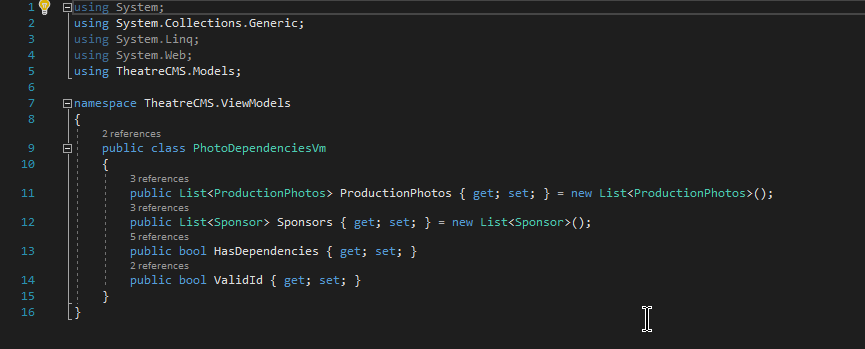

<h3> Introduction</h3>

For the last stretch of my time as a student at the tech academy, I worked on a live project that simulated a real world development scenario. The live projects are 2 week sprints working with various technologies, both front end and back end. The following is a step by step example of my thought process through one of my more intricate contributions. 

<h3> Background context </h3>

  
The project was an ASP.NET MVC website for a theatre company who wanted to update the look and functionality of their site. Users were able to view the productions and actors for each production, and admins were able to edit content on the site through an administrator login. My task was to create a method for checking if photos within the database were in use anywhere on the site, and display that information. Additionally, I was to add a way to update the photos with a final verification if the photos were used on the site. 

<h3> I began by creating a ViewModel </h3>

I needed a way to store the information from my database query and to pass the information to the View. To do this, I created a ViewModel as shown below.    
&nbsp;&nbsp;&nbsp;&nbsp;&nbsp;&nbsp;  
  Because there were possibly multiple "Sponsors" and "ProductionPhotos", I made each property a list to hold multiple objects.

<h3> Next, I created the FindDependencies method </h3>

 

I began by using my ViewModel as the return type within the method declaration to be used in the View. This allowed me to access the information I needed from the front-end of the framework. Moving on, I opened a connection to the database and instantiated a ViewModel object. After a quick check for a null value from the argument variable, I created an instance of the photo and sponsor objects and stored what was returned from the argument Id.   Next I make a quick logic check to see if 

